# Лабораторная работа №2. Облачные вычислительные сервисы. Amazon EC2

## 1. Шапка

- **ФИО:** Gausater Eduard
- **Группа / специальность:** I2404, Informatica
- **Уровень:** продвинутый
- **Приложение:** TimeCapsule (Laravel-вариант)
- **Вариант деплоя:** B — скрипт `~/deploy.sh`

> Примечание: IP менялся после Stop/Start: `3.78.186.137` → `3.64.62.67` → `63.178.71.137`

---

## 2. Базовый уровень

### Задание 1. Подготовка аккаунта

Пользователь IAM `cloudstudent` с политикой `AdministratorAccess`, бюджет `Zero spend budget`.

| IAM `cloudstudent` | Budget `ZeroSpend` |
|---|---|
| 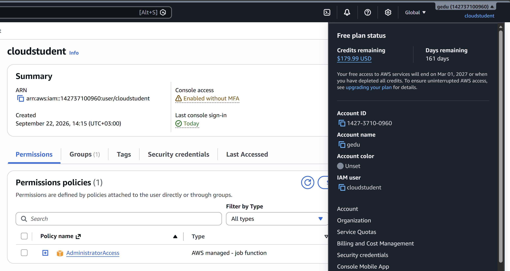 | 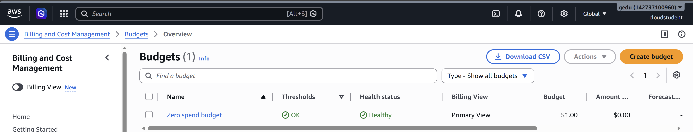 |

- `scr1.png` — пользователь `cloudstudent`, политика `AdministratorAccess`.
- `scr2.png` — бюджет `Zero spend budget` в `Billing and Cost Management → Budgets`, `$1.00 / $0.00`, `Healthy`.

> Q: Что разрешает политика `AdministratorAccess`? Почему для повседневной работы нельзя использовать root?
>
> A: Хотя политика `AdministratorAccess` разрешает всё, использование отличного от root аккаунта является стандартной практикой. root — системный пользователь без ограничений, тогда как для других пользователей ограничения можно (и нужно) наложить и иметь более понятную и логичную иерархию доступа.

### Задание 2. Запуск экземпляра EC2

Параметры: Name `webserver`, AMI `Amazon Linux 2023`, `t3.micro`, keypair `ED25519 .pem`, SG `webserver-sg` (SSH My IP + HTTP Anywhere), User data `dnf install htop nginx`.

| AMI | Security Group | User data |
|---|---|---|
| 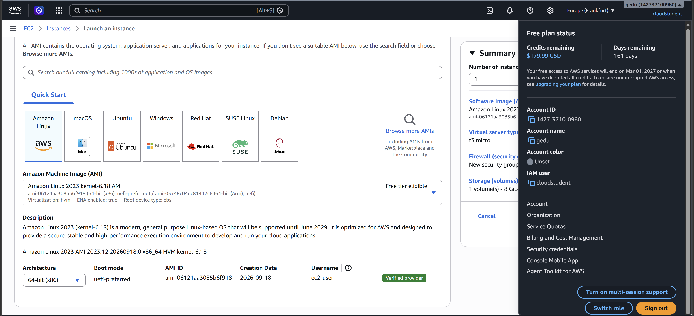 | 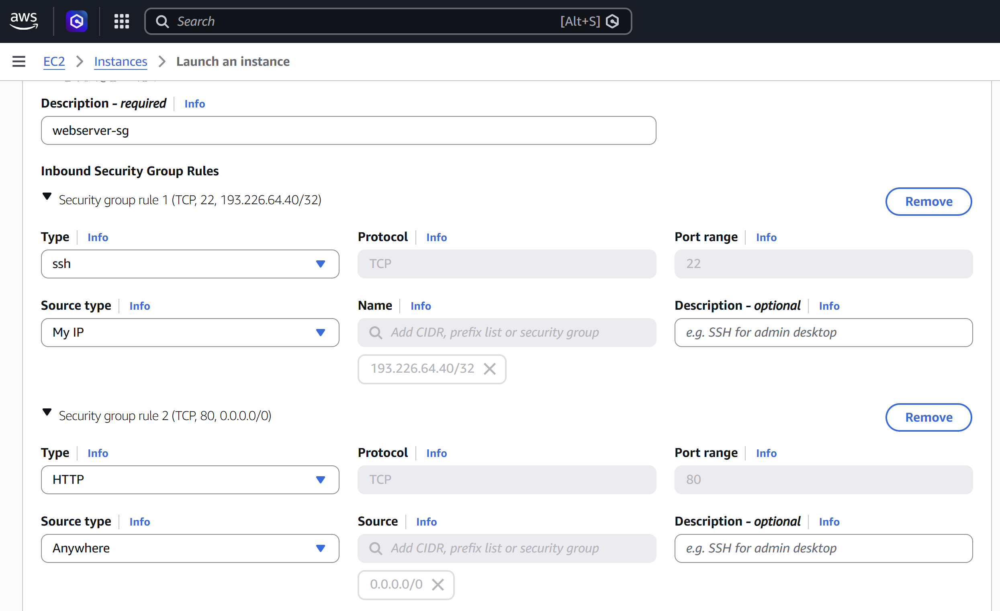 | 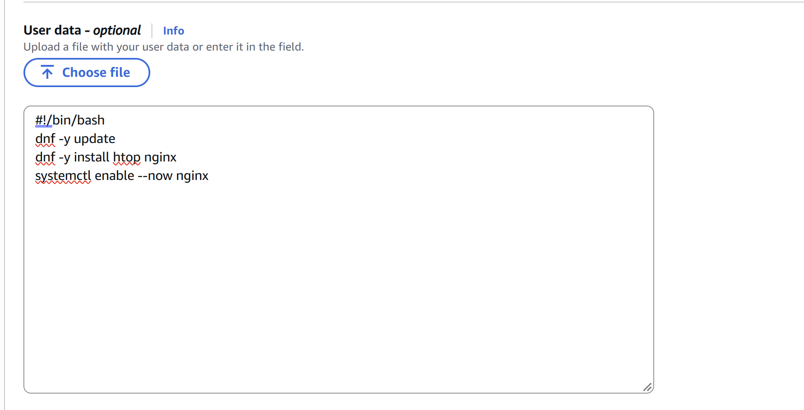 |

- `scr3.png` — выбор AMI `Amazon Linux 2023`.
- `scr4.png` — SG `webserver-sg`: `SSH 22 My IP`, `HTTP 80 Anywhere`.
- `scr5.png` — `User data`: `dnf -y update`, `dnf -y install htop nginx`, `systemctl enable --now nginx`.

| Running + Status check | nginx Welcome |
|---|---|
| 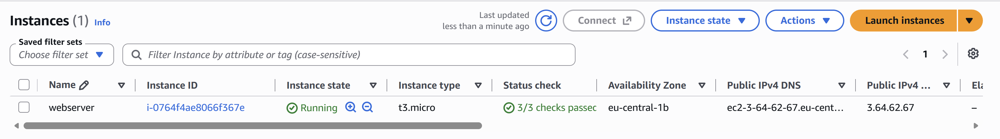 | 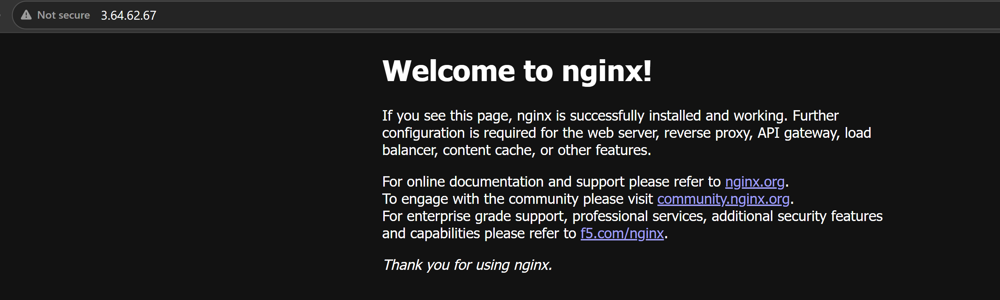 |

- `scr6.png` — `webserver` `Running`, `3/3 checks passed`, `3.64.62.67`.
- `scr7.png` — `Welcome to nginx!` по `http://3.64.62.67`.

> Q: Что такое User data и когда выполняется этот скрипт? Выполнится ли он повторно после перезагрузки?
>
> A: User data — выполняет описанные команды в процессе первой настройки сервера. После перезагрузки соответственно ничего выполняться не будет.

### Задание 3. Мониторинг и диагностика

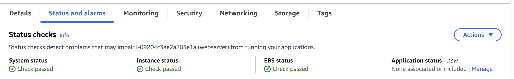
- `scr8.png` — `Status and alarms`: `System / Instance / EBS — Check passed`.

> Q: Какая из проверок укажет на проблему, которую можете исправить вы, а какая на проблему на стороне AWS?
>
> A: _Attached EBS status check_ и _Instance status check_ — в некоторых случаях могут быть исправлены нами, но не всегда. _System status check_ — решается только на стороне AWS.

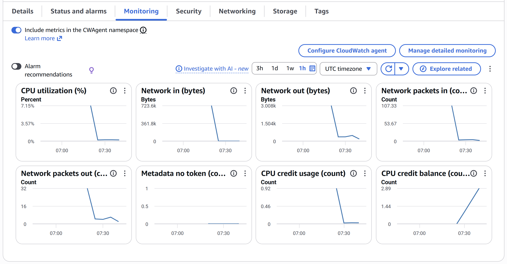
- `scr9.png` — вкладка `Monitoring` (CloudWatch): CPU, Network in/out, packets, CPU credits. Базовый мониторинг.

> Q: В каких случаях стоит включать детальный мониторинг?
>
> A: Когда нужна точность выше обычной. Например для отладки пиков нагрузки, автоскейлинга и алертов, где интервал 5 минут слишком грубый, а цена детального мониторинга оправдана.

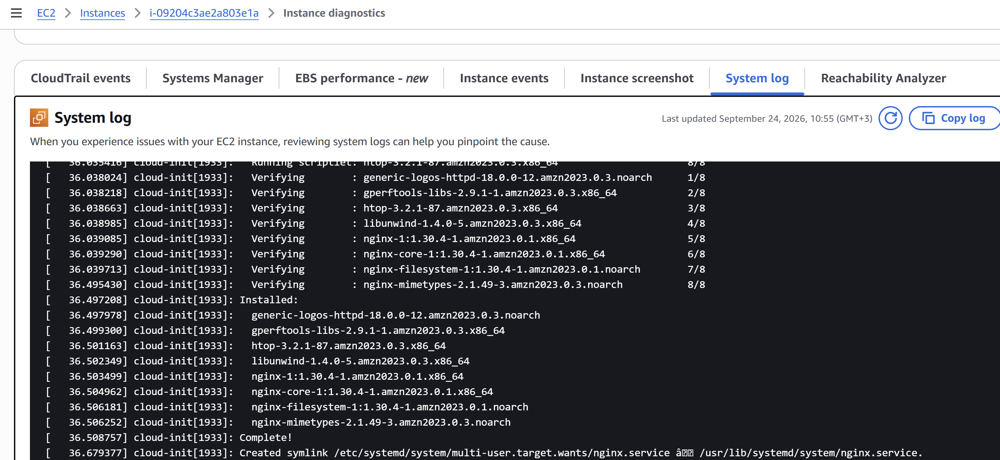
- `scr10.png` — `Get system log`: видно `cloud-init`, установку `htop/nginx 1:1.30.4`, `Complete!`, `symlink nginx.service`.

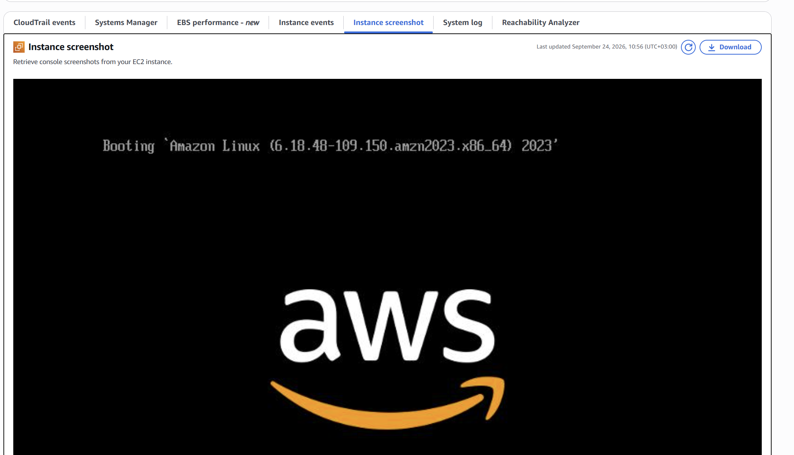
- `scr11.png` — `Get instance screenshot`: загрузка `Amazon Linux 2023`, логотип `aws`.

### Задание 4. Подключение по SSH

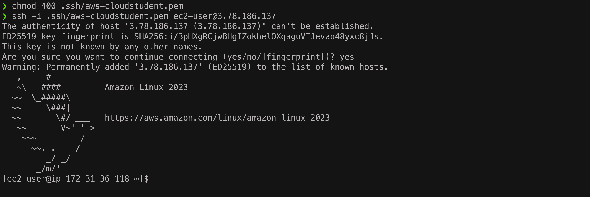
- `scr12.png` — `chmod 400`, `ssh -i aws-cloudstudent.pem ec2-user@3.78.186.137`, `yes`, приглашение `[ec2-user@ip-172-31-36-118 ~]$`.

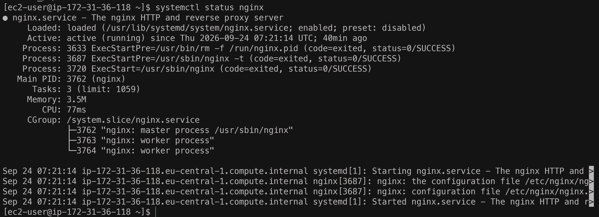
- `scr13.png` — `systemctl status nginx`: `active (running)`, `enabled`, `master + 2 worker`.

> Q: Почему для входа на экземпляр EC2 используется ключ, а не пароль?
>
> A: Доступ по паролю — вопрос времени, при условии что сервер доступен 24/7 и нет fail2ban, у ботов уйдет не так уж много времени на его подбор. Ключ ED25519 нельзя перебрать, его можно отозвать, и он не путешествует по сети при каждом входе.

### Задание 5. Статический сайт

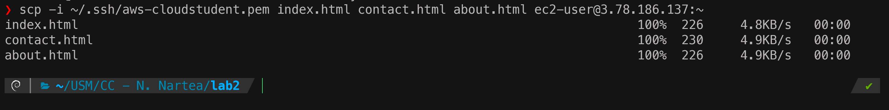
- `scr14.png` — `scp -i ... index.html contact.html about.html ec2-user@3.78.186.137:~`, `100%`.

> Q: Что делает команда `scp` и чем она похожа на `ssh`?
>
> A: `scp` копирует файлы с текущей машины на удаленную. Предположительно через SSH туннель: та же аутентификация по ключу, тот же порт 22 и тот же `ec2-user@host`.

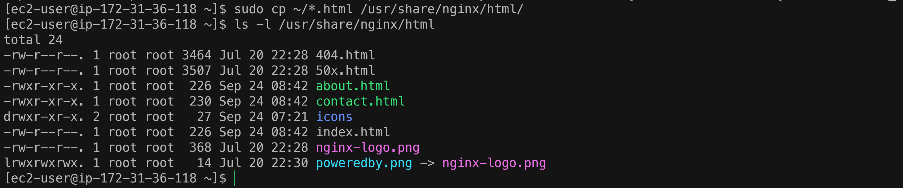
- `scr15.png` — на сервере: `sudo cp ~/*.html /usr/share/nginx/html/`, `ls -l` показывает `index/about/contact.html`.

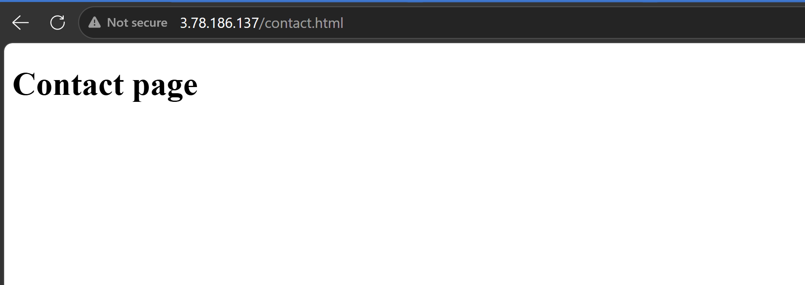
- `scr16.png` — `http://3.78.186.137/contact.html` — `Contact page` открывается.

### Задание 6. Остановка через AWS CLI

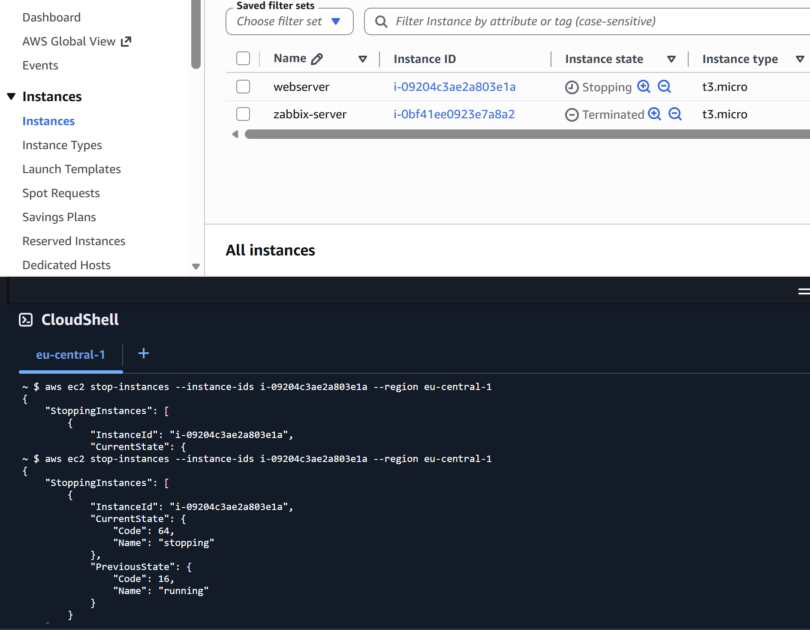
- `scr17.png` — CloudShell `eu-central-1`: `aws ec2 stop-instances --instance-ids i-09204c3ae2a803e1a --region eu-central-1`, `stopping`, инстанс `webserver Stopping`.

> Q: Чем `Stop` отличается от `Terminate`? За что вы продолжаете платить, пока экземпляр остановлен?
>
> A: `Stop` выключает ОС, Terminate — удаляет экземпляр. Если просто выключить экземпляр, то придется платить за хранилище EBS и за выделенный Elastic IP (если есть).

---

## 3. Продвинутый уровень

### Задание 7. Организация и репозиторий

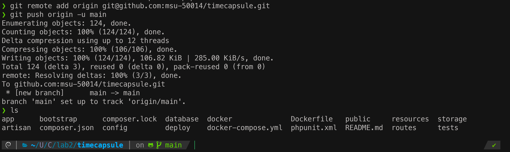
- `scr18.png` — `git push origin -u main` в `git@github.com:msu-50014/timecapsule.git`, `124 objects`, `ls`: `artisan, composer.json, public, routes, storage` — Laravel-версия TimeCapsule.

> Q: Почему папка `vendor/` и файл `.env` не попали в репозиторий?
>
> A: `.gitignore` описывает файлы и/или директории которые git не будет добавлять в репозиторий и следить за их изменениями. `vendor/` пересобирается через `composer install`, а `.env` — секрет окружения, разный на каждой машине.

### Задание 8. Подготовка сервера

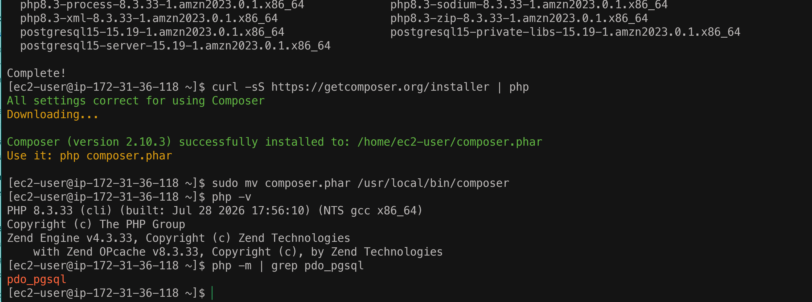
- `scr19.png` — `php -v`: `PHP 8.3.33`, `php -m | grep pdo_pgsql` → `pdo_pgsql`, установка `postgresql15-server`, `composer 2.10.3` в `/usr/local/bin/composer`.

> Q: Почему мы устанавливаем эти пакеты вручную, а не добавляем их в User data?
>
> A: User data выполняется один раз при первом старте и подходит только для базового образа с nginx. Точные версии PHP, pgsql-драйвера и composer проще ставить и проверять вручную командой `php -m`. Длинный User data делает старт долгим, а любая ошибка в нём роняет весь запуск. Для повторяемости правильнее делать свой AMI или Ansible, а не раздувать User data.

### Задание 9. База данных PostgreSQL

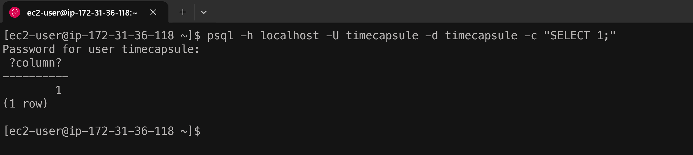
- `scr_db_select1.png` — `psql -h localhost -U timecapsule -d timecapsule -c "SELECT 1;"` запрашивает пароль и возвращает `1 / (1 row)` — подключение по `scram-sha-256` работает.

> Выполнить на EC2:
> ```bash
> sudo postgresql-setup --initdb
> sudo sed -i 's/ident$/scram-sha-256/' /var/lib/pgsql/data/pg_hba.conf
> sudo systemctl enable --now postgresql
> sudo -u postgres psql -c "CREATE USER timecapsule WITH PASSWORD 'ваш-пароль';"
> sudo -u postgres psql -c "CREATE DATABASE timecapsule OWNER timecapsule;"
> psql -h localhost -U timecapsule -d timecapsule -c "SELECT 1;"
> ```

### Задание 10. Развёртывание кода

> Выполнить на EC2:
> ```bash
> sudo mkdir -p /var/www/timecapsule
> sudo chown ec2-user:ec2-user /var/www/timecapsule
> git clone https://github.com/msu-50014/timecapsule.git /var/www/timecapsule
> nano /var/www/timecapsule/.env
> chmod 640 .env; sudo chgrp apache .env; sudo chown -R apache:apache storage
> composer install --no-dev --optimize-autoloader
> php artisan migrate --force
> ```

> Q: Почему пароль к БД хранится в `.env` на сервере, а не в коде в репозитории? Почему публичный репозиторий безопасен?
>
> A: Пароль — секрет окружения, а не кода. Репозиторий публичный, его клонирует кто угодно, а история git хранится вечно — попавший туда пароль уже не удалить. `.env` лежит в `.gitignore`, на сервере имеет права `640` и группу `apache`, снаружи недоступен: nginx отдаёт только `public/`, а скрытые файлы запрещены правилом `location ~ /\.`. Без `.env` чужой клон кода не подключается к нашей базе.

### Задание 11. PHP-FPM и nginx

> Выполнить на EC2:
> ```bash
> sudo sed -i 's/^upload_max_filesize.*/upload_max_filesize = 6M/' /etc/php.ini
> sudo nano /etc/nginx/conf.d/timecapsule.conf
> sudo nginx -t
> sudo systemctl enable --now php-fpm
> sudo systemctl restart nginx
> ```

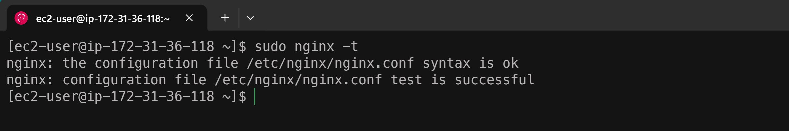
- `scr_nginx_t.png` — `sudo nginx -t`: `syntax is ok`, `test is successful`.

| Приложение | `/health` |
|---|---|
| 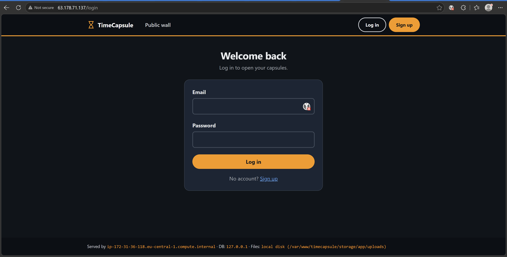 | 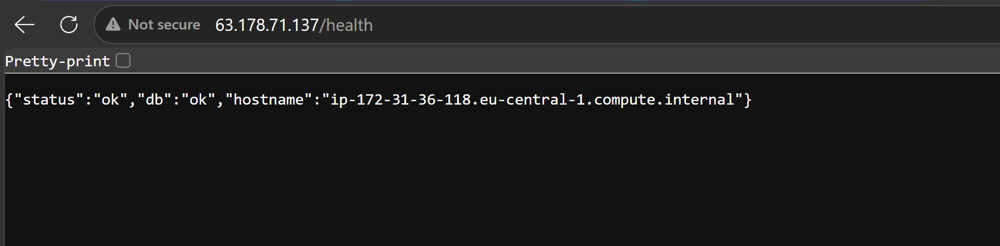 |

- `scr20.png` — `http://63.178.71.137/login` — `TimeCapsule, Welcome back`, футер `Served by ip-172-31-36-118...`.
- `scr23.png` — `http://63.178.71.137/health` → `{"status":"ok","db":"ok","hostname":"ip-172-31-36-118..."}`.

### Задание 12. Обновление, `deploy.sh` (Вариант B)

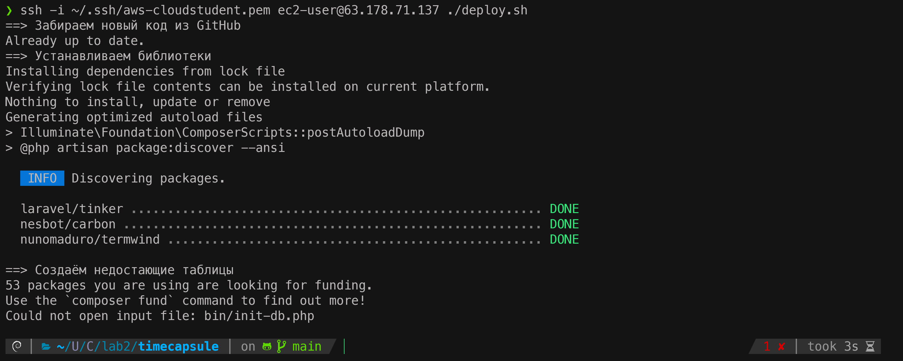
- `scr21.png` — запуск со своего ПК: `ssh -i ~/.ssh/aws-cloudstudent.pem ec2-user@63.178.71.137 ./deploy.sh`, `Already up to date`, `Installing dependencies`, `Discovering packages DONE`.

> Q: `git pull` заменяет файлы по одному, что увидит посетитель? Что если не выполнить `composer install`?
>
> A: Деплой занимает несколько секунд, файлы заменяются неатомарно. Посетитель может получить половину старых и половину новых файлов — белый экран или PHP fatal error. Если после `pull` не сделать `composer install`, код будет требовать новые классы из `vendor`, которых нет, и сайт упадёт с 500. Поэтому порядок `pull → install → migrate → reload` обязателен.

### Задание 13. Новая версия, поломка и откат

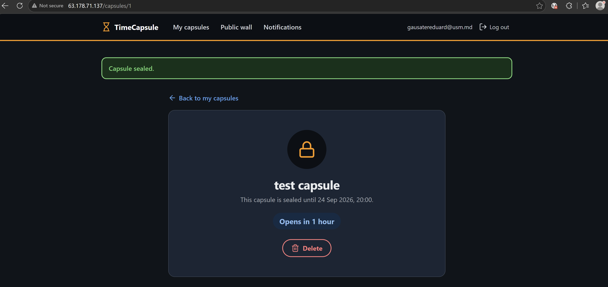
- `scr22.png` — проверка приложения: `Capsule sealed`, `test capsule`, `sealed until 24 Sep 2026`.

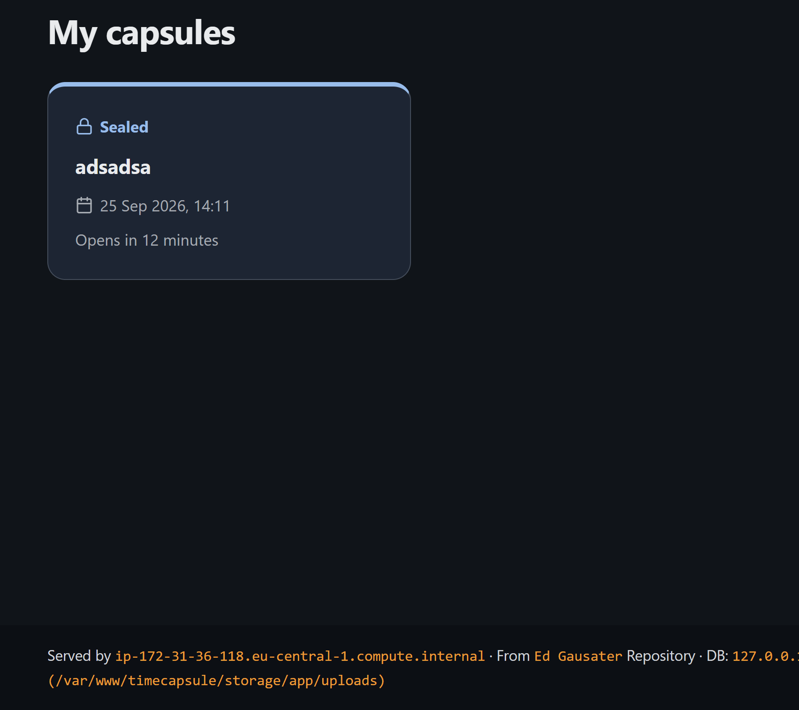
- `scr24.png` — новая версия: `My capsules`, капсула `adsadsa`, футер `From Ed Gausater Repository` — изменение в подвале видно, данные не пропали.

| Ошибка 500 | `/health` при этом `ok` |
|---|---|
| 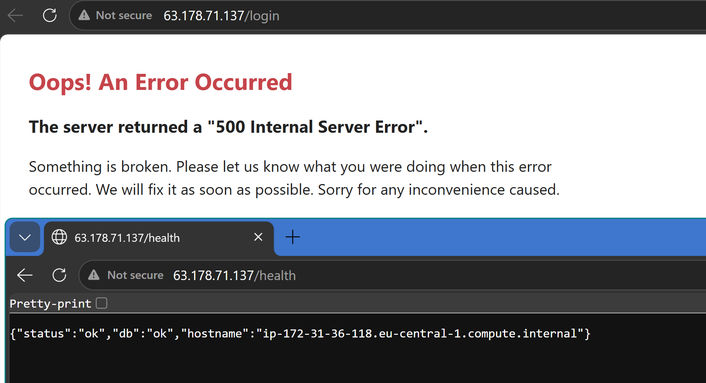 |  |

- `scr25.png` — сломанный деплой `<?php broken(`: главная `/login` → `500 Internal Server Error`, а `/health` при этом `{"status":"ok","db":"ok"}`.

> Q: Почему `/health` отвечает `ok`, хотя главная не работает? Что он проверяет? Чего не хватает?
>
> A: `/health` проверяет только что PHP-FPM жив и есть коннект к БД, он не рендерит шаблоны. Главная падает, потому что битый `views/layout.php` подключается при каждом рендере. Такой проверке не хватает smoke-рендера главной страницы и проверки синтаксиса `php -l`.

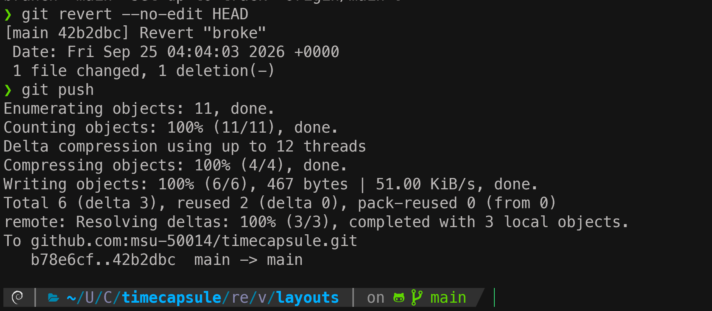
- `scr26.png` — откат через репозиторий: `git revert --no-edit HEAD` → `Revert "broke"`, `git push` в `msu-50014/timecapsule.git main`, затем повторный `./deploy.sh`, сайт снова работает.

> Q: Сколько времени сайт был сломан? Из чего сложилось время? Как сократить?
>
> A: Время поломки — от пуша битого коммита до конца повторного деплоя после revert. Складывается из времени обнаружения, `revert + push`, `pull + install + reload` и кэша браузера. Сократить можно проверкой `php -l` в `deploy.sh`, health-чеком с рендером, автодеплоем по push и атомарным релизом через symlink.

---

## 4. Архитектура и ADR

 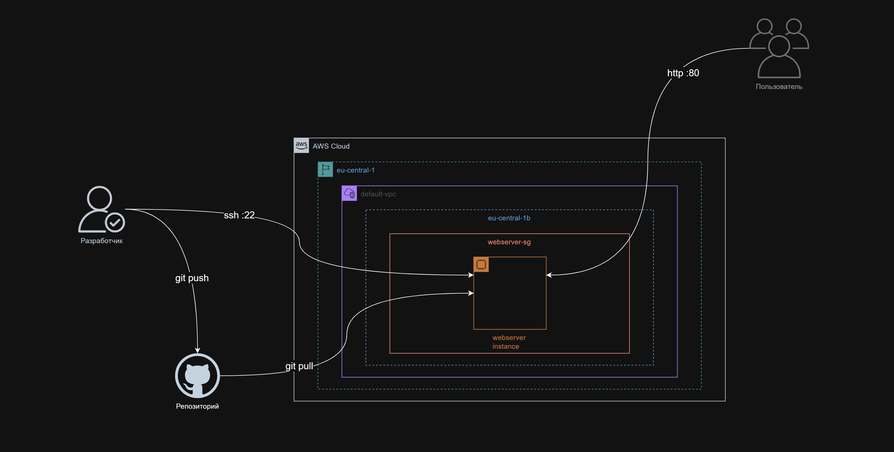 

- ADR: [docs/adr/0001-deploy-method.md](docs/adr/0001-deploy-method.md) — заполните по шаблону (вариант B, `deploy.sh`): контекст, решение, альтернативы (ручной деплой A / CI), последствия.

---

## 5. Контрольные вопросы (продвинутый уровень)

**1. Как проходит запрос от браузера до БД? Роль каждой программы?**

Браузер → `nginx:80` → nginx отдаёт статику из `public/` → далее через php-fpm интерпретируется `fastcgi_pass unix:/run/php-fpm/www.sock` → Laravel-приложение → через библиотеку `pdo_pgsql` подключается к базе → `localhost:5432`. nginx — фронт и статика, PHP-FPM — выполнение кода, PostgreSQL — хранение капсул, файлов-метаданных и сессий.

**2. Почему сервер может скачивать код, но не может отправлять изменения? Почему это правильно?**

Репозиторий публичный, чтение по HTTPS доступно без аутентификации, а push требует логин/токен, которых на сервере нет. Это правильно: компрометация сервера не даёт переписать код в GitHub и заразить следующий деплой.

**3. Что будет с файлами пользователей при удалении EC2? Связь с EBS?**

Пропадёт всё что лежит на EBS-томе инстанса. По умолчанию том удаляется вместе с инстансом. Поэтому нужны снапшоты EBS или внешнее хранилище S3 и отдельный хост базы данных.

**4. Что общего у `deploy.sh` с CI/CD? Чего не хватает?**

Одной командой обновляет и перезапускает приложение, запускается удалённо по SSH. Не хватает автотриггера по push, тестов, сборки, хранения секретов и истории деплоев.
